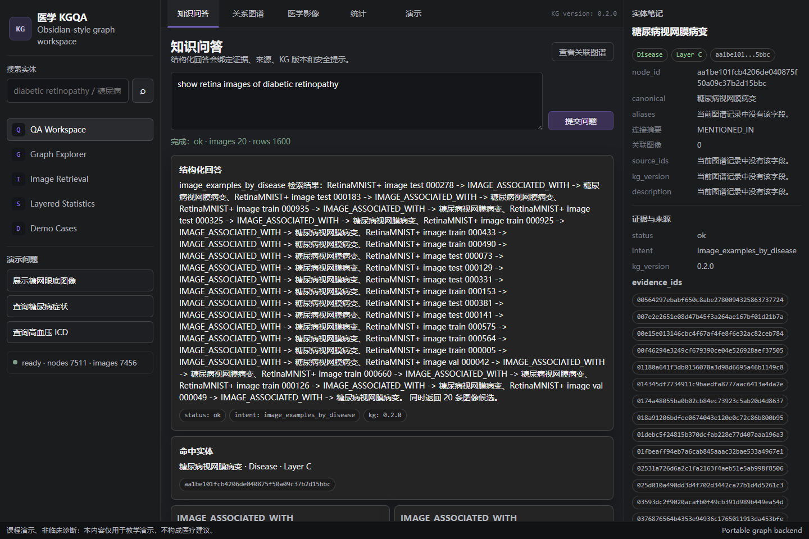
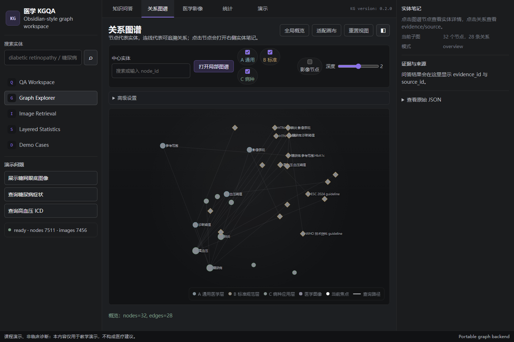
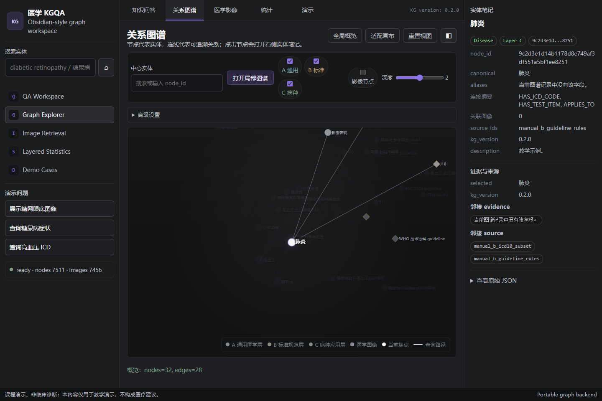
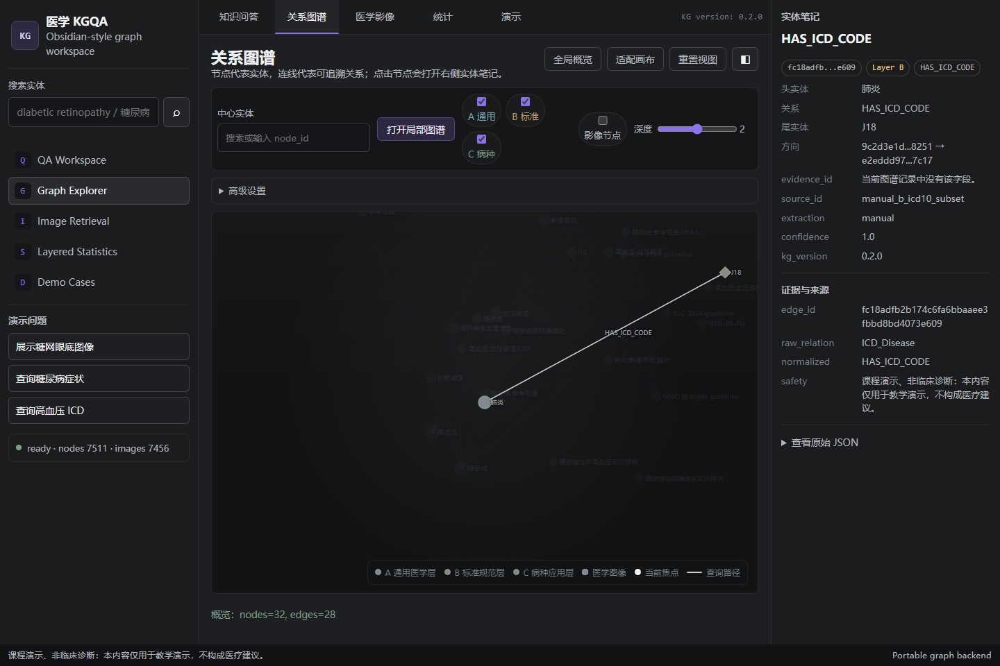
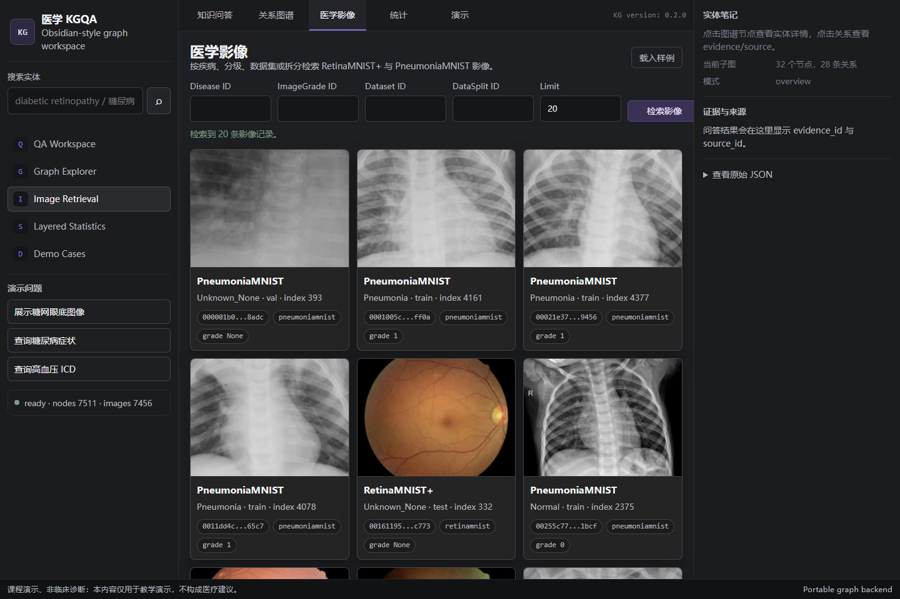
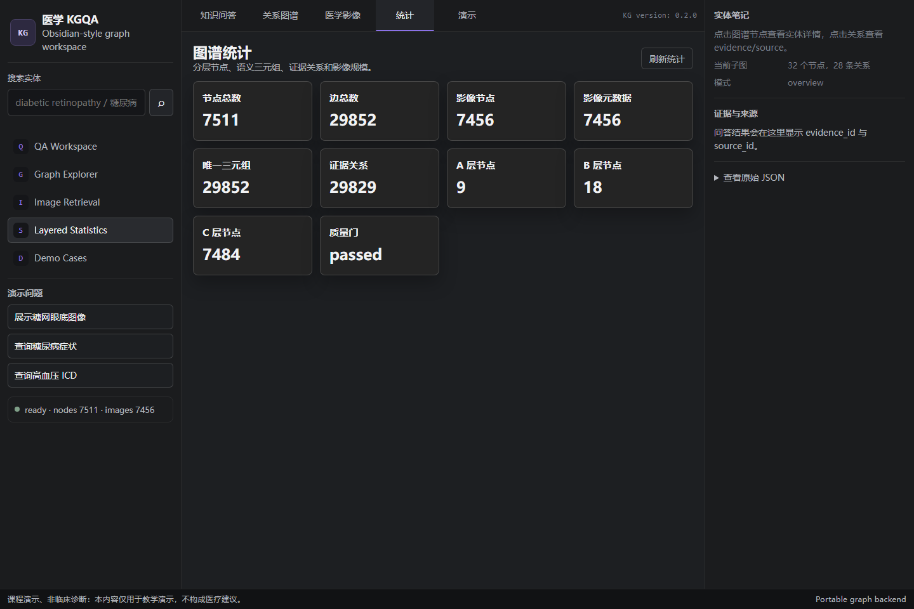
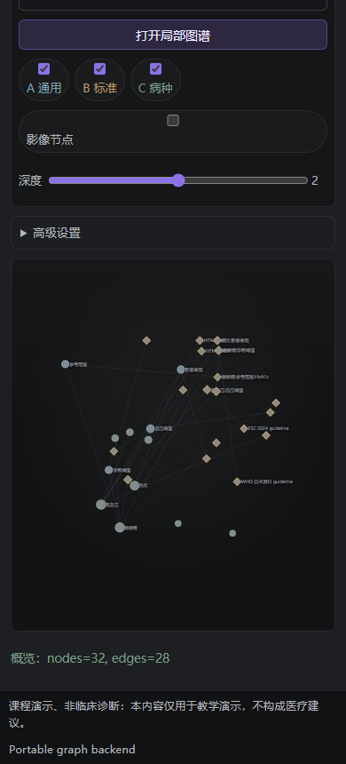

<!--
title: Diabetes MMKGQA
authors: Xiao Fang; XinYuan Zhang; Shuo Ma
contact: fangtoast@foxmail.com
copyright: Copyright (c) 2026 Xiao Fang, XinYuan Zhang, and Shuo Ma
license: MIT
-->

<div align="center">
  <h1>Diabetes MMKGQA</h1>
  <p><strong>Diabetes &amp; Multimodal Medical KGQA Platform (Educational)</strong></p>
  <p>
    <a href="#readme-zh-cn">中文</a> ·
    <a href="#english-summary">English</a> ·
    <a href="docs/project_plan.md">项目计划</a> ·
    <a href="docs/architecture.md">架构说明</a> ·
    <a href="AGENTS.md">执行规则</a>
  </p>
</div>

---

<span id="readme-zh-cn"></span>

## 这是一个什么项目

本仓库是国防科技大学知识图谱课程项目，用于搭建可复现的分层（A/B/C）医学知识图谱与多模态问答平台。该仓库用于教学与研究演示，不构成医疗诊断或治疗建议。

## 文档入口

- [项目计划（长期目标）](docs/project_plan.md)
- [执行提示](docs/codex_target_prompt.md)
- [任务台账](TASKS.md)
- [阶段进度日志](docs/progress_log.md)
- [架构说明](docs/architecture.md)
- [图谱工作台使用指南](docs/graph_workspace_guide.md)
- [前端 vendor 说明](docs/frontend_vendor.md)
- [作者与联系方式](AUTHORS.md)
- [开源许可证](LICENSE)
- [第三方许可与数据边界](THIRD_PARTY_NOTICES.md)
- [数据来源说明](data/source_manifest.yaml)
- [本体定义](configs/ontology.yaml)
- [意图定义](configs/intents.yaml)
- [构建与交付规则](AGENTS.md)

## 作者与联系方式

- 合作人：Xiao Fang、XinYuan Zhang、Shuo Ma
- 联系方式：`fangtoast@foxmail.com`
- 课程归属：国防科技大学知识图谱课程项目

## 开源许可与数据声明

本项目原创代码、项目自有文档和课程维护材料按 [MIT License](LICENSE) 开源。第三方数据、第三方依赖和受限语料不因本仓库的 MIT 许可而被重新授权，具体边界见 [THIRD_PARTY_NOTICES.md](THIRD_PARTY_NOTICES.md) 与 [data/source_manifest.yaml](data/source_manifest.yaml)。

MedMNIST 数据根文件和完整 DiaKG 原始语料默认不随仓库再分发；如需复现实验，请按来源说明自行获取授权数据或使用仓库内受控 fixture。所有界面与问答输出均为课程演示、非临床诊断用途。

## 快速开始（Windows）

### 0）先准备环境（推荐）

#### 方式 A（推荐）：`conda`（如已安装）

```powershell
conda create -n diabetes-mmkgqa python=3.12 -y
conda activate diabetes-mmkgqa
python -m pip install --disable-pip-version-check -r requirements-lock.txt
python -m pip install -e .
```

#### 方式 B（推荐）：`venv`（需要按照venv新建环境的操作进行准备）

```powershell
python -m venv .venv
.\.venv\Scripts\Activate.ps1
python -m pip install --disable-pip-version-check -r requirements-lock.txt
python -m pip install -e .
```

> 当前仓库已在本地 `.venv` 中完成一次完整验证：`backend=portable` 可启动、`/health` 正常返回。

### 1）最小可运行链路（任选其一）

#### 方案 1：使用 `make`（有 `make` 时）

```powershell
# bootstrap（校验+初始化）
make bootstrap
make data
make kg
make load
make up
```

#### 方案 2：无 `make` 时使用 PowerShell 包装脚本

```powershell
.\scripts\run.ps1 bootstrap
.\scripts\run.ps1 data
.\scripts\run.ps1 kg
.\scripts\run.ps1 load
.\scripts\run.ps1 up
```

服务启动后默认监听 `http://127.0.0.1:8000`。

- Web 界面：`http://127.0.0.1:8000/ui`
- 关系图谱直达：`http://127.0.0.1:8000/ui?tab=graph`
- 健康检查：`http://127.0.0.1:8000/health`
- API 文档：`http://127.0.0.1:8000/docs`

### 1.5）推荐：一键启动（自动化）

```powershell
# 一键启动（默认执行图谱构建+导入+启动 API，并自动打开 UI）
.\scripts\start.ps1

# 已有图谱产物时可跳过部分步骤
.\scripts\start.ps1 -SkipData
.\scripts\start.ps1 -SkipData -SkipKg -SkipLoad

# 指定端口、禁用自动打开浏览器
.\scripts\start.ps1 -Port 8010 -NoBrowser
```

默认行为：
- 顺序执行 `cli data -> kg -> load -> up`（`load` 使用 `portable` 后端）
- 启动后自动等待 `/health`
- 成功后自动打开 `http://127.0.0.1:8000/ui`（可加 `-NoBrowser` 关闭）

> 脚本可用于课程演示的快速回放；如为正式回归，建议先单独执行 `.\scripts\run.ps1 bootstrap` 完成依赖与环境准备。

#### Web 启动复核

如果默认 `8000` 端口已被占用，可以临时指定其他端口：

```powershell
.\scripts\start.ps1 -Port 8012 -SkipData -SkipKg -SkipLoad -NoBrowser
```

最近一次本地复核使用上述命令启动成功，并确认：

| 检查项 | 结果 |
|---|---:|
| `/health` | `status=ready`, `backend_ready=true`, `backend=portable` |
| portable graph | `nodes=7511`, `edges=29852`, `images=7456` |
| `/ui` | `200` |
| `/ui?tab=graph` | `200` |
| `/graph/overview?limit=80&include_images=false` | `nodes=32`, `edges=28` |

该复核只验证 Web/API 启动，不重建数据或图谱；如果你修改了数据、解析器或图谱构建逻辑，请先运行 `.\scripts\run.ps1 kg` 与 `.\scripts\run.ps1 verify`。

### 2）快速验收（可复现）

```powershell
# 后端可用性
curl http://127.0.0.1:8000/health

# 问答 API（返回 evidence/source/kg_version/safety_notice）
Invoke-RestMethod -Method Post http://127.0.0.1:8000/qa `
  -ContentType "application/json" `
  -Body '{"question":"糖尿病患者常见并发症有哪些？"}'
```

### 3）演示与打包（按任务需要执行）

```powershell
make demo      # 或：.\scripts\run.ps1 demo
make report    # 或：.\scripts\run.ps1 report
make verify    # 或：.\scripts\run.ps1 verify
make package   # 或：.\scripts\run.ps1 package
```

### 4）真实数据接入状态

- [x] 已登记来源与校验规则：`data/source_manifest.yaml`
- [x] 已提供离线联调备选：`data/raw/diakg/diakg_fixture.json`
- [x] 已接入真实图像根文件：`data/raw/retinamnist/retinamnist_224.npz`、`data/raw/pneumoniamnist/pneumoniamnist_224.npz`
- [x] 图谱产物已统计到真实图像：
  - `image_metadata_count = 7456`
  - `image_node_count = 7456`
  - `warnings = []`

如需重建产物可执行：
- `python -m diabetes_mmkgqa_starter.cli data --repo-root .`
- `python -m diabetes_mmkgqa_starter.cli kg --repo-root .`
- `python -m diabetes_mmkgqa_starter.cli load --backend portable --repo-root .`

## 功能演示命令（可直接复现）

```powershell
# 激活虚拟环境后（.venv 或 conda）可直接运行
python -m diabetes_mmkgqa_starter.cli data
python -m diabetes_mmkgqa_starter.cli kg --repo-root .
python -m diabetes_mmkgqa_starter.cli load --backend portable --repo-root .
python -m diabetes_mmkgqa_starter.cli demo --repo-root . --demo-output-json demo_cases.json
python -m diabetes_mmkgqa_starter.cli report --repo-root .
python -m diabetes_mmkgqa_starter.cli verify --repo-root .
python -m diabetes_mmkgqa_starter.cli package --repo-root .
```

> 如果你直接在 `scripts/run.ps1` 里切了工作目录，需要确保仍位于 `D:\\project\\diabetes_mmkgqa_starter` 仓库根目录。

## 知识问答可问什么

当前 QA 是证据约束的课程演示，不是开放医疗聊天。推荐先从这些已验证问题开始：

| 类别 | 可直接输入的问题 | 预期返回 |
|---|---|---|
| 疾病知识 | `糖尿病有哪些症状` | 症状关系、证据/source、KG 版本 |
| 检查项 | `糖尿病需要做哪些检查` | 检查/检查项关系 |
| 标准编码 | `高血压的ICD编码是什么` | ICD 编码关系 |
| 多模态影像 | `糖尿病视网膜病变有哪些影像示例` | RetinaMNIST+ 影像候选与预览 |

也可以尝试英文等价问法，例如 `what are symptoms of diabetes`、`ICD code for hypertension`、`show retina images of diabetic retinopathy`。药物、副作用、参考范围、数据集或拆分检索属于受支持意图；如果当前图谱没有相应实体或存在歧义，系统会返回 `not_found` 或澄清候选，而不会编造医学事实。

## 报告与交付材料

- `docs/report_inputs.md`：固定报告输入材料（版本、统计、来源、案例与路径）
- `docs/cases/demo_cases.json`：5 个固定案例（含证据字段）
- `docs/screenshots/demo_*.png`：本地生成的演示截图（默认被 Git 忽略）
- `deliverables/diabetes_mmkgqa_deliverables.zip`：最终交付包及清单

## 网页截图与功能演示

README 展示图已重新生成并放入 `docs/assets/readme/`。该目录用于保存随说明文档展示的稳定截图，不在当前 `.gitignore` 忽略规则中；`docs/screenshots/` 仍保留为 CLI/demo/视觉验证的本地临时截图目录，默认不随 Git 跟踪。

### 项目工作台

| QA 工作台：英文问题命中图像检索意图，返回 evidence/source/kg_version/safety_notice | 图谱总览：默认打开 A/B/C 分层医学知识图谱 |
|---|---|
|  |  |

### 图谱交互

| 节点聚焦：点击实体后高亮邻居并打开右侧实体笔记 | 关系路径：点击关系后展示 head/tail、evidence、source 和 provenance |
|---|---|
|  |  |

### 多模态与统计

| 影像检索：从本地 MedMNIST npz 生成真实 PNG 预览 | 图谱统计：展示节点、边、影像节点、证据关系和质量门 |
|---|---|
|  |  |

### 响应式图谱

| 窄屏视口下的 Graph Explorer |
|---|
|  |

Graph Explorer 入口：`http://127.0.0.1:8000/ui?tab=graph`。如果你使用了自定义端口，请把 URL 中的端口同步替换，例如 `http://127.0.0.1:8012/ui?tab=graph`。使用说明见 [图谱工作台使用指南](docs/graph_workspace_guide.md)。

### 如何更新 README 展示图

1. 启动 Web 服务：`.\scripts\start.ps1 -SkipData -SkipKg -SkipLoad -NoBrowser`。
2. 访问 `/health`、`/ui`、`/ui?tab=graph`，确认服务可用后再截图。
3. 重新生成 README 展示图：

```powershell
node .\scripts\capture_readme_screenshots.mjs --base-url http://127.0.0.1:8000 --out-dir docs/assets/readme
```

4. CLI 演示截图可通过 `python -m diabetes_mmkgqa_starter.cli demo --repo-root . --demo-screenshot-dir docs/screenshots` 刷新。
5. 因 `docs/screenshots/` 默认被忽略，若课程提交需要把演示截图放入交付包，请确认打包流程或显式收集这些本地产物。

## 项目边界（必须遵守）

- 所有回答必须返回 `evidence_ids`、`source_ids`、`kg_version`、`safety_notice`
- 禁止基于原始用户文本拼接生成 Cypher
- 默认以 `Portable` 后端为主要可运行路径（无 Docker 依赖）

---

<span id="english-summary"></span>

## English summary

This project is an educational Knowledge Graph course project at the National University of Defense Technology. It provides a reproducible layered (A/B/C) medical KGQA platform with multimodal support.

- Follow the same source-of-truth contract as `AGENTS.md` and `docs/project_plan.md`.
- Use the `make` command suite or `scripts/run.ps1` wrapper for reproducible workflows.
- Keep all responses educational and evidence-bounded.
- Original project code and project-owned documentation are released under the MIT License; third-party datasets and vendored dependencies retain their own terms.
