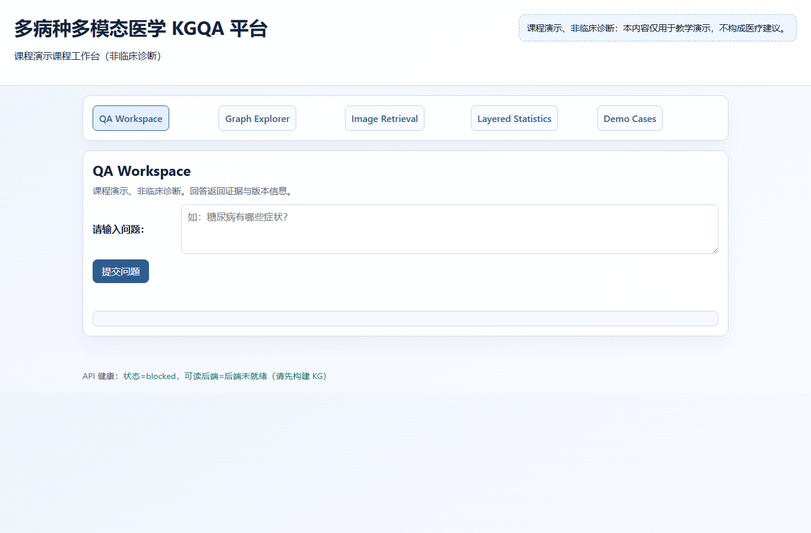
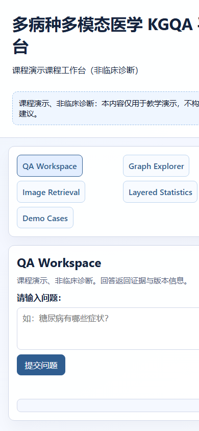

<!--
title: Diabetes MMKGQA
author: Diabetes MMKGQA Starter
email: diabetes-mmkgqa-starter
copyright: Educational use only
-->

<div align="center">
  <h1>Diabetes MMKGQA</h1>
  <p><strong>Diabetes &amp; Multimodal Medical KGQA Platform (Educational)</strong></p>
  <p>
    <a href="#readme-zh-cn">中文</a> ·
    <a href="#english-summary">English</a> ·
    <a href="docs/project_plan.md">项目计划</a> ·
    <a href="docs/architecture.md">架构说明</a> ·
    <a href="AGENTS.md">执行规则</a>
  </p>
</div>

---

<span id="readme-zh-cn"></span>

## 这是一个什么项目

本仓库是课程演示项目，用于搭建可复现的分层（A/B/C）医学知识图谱与多模态问答平台。该仓库用于教学与研究演示，不构成医疗诊断或治疗建议。

## 文档入口

- [项目计划（长期目标）](docs/project_plan.md)
- [执行提示](docs/codex_target_prompt.md)
- [任务台账](TASKS.md)
- [阶段进度日志](docs/progress_log.md)
- [架构说明](docs/architecture.md)
- [数据来源说明](data/source_manifest.yaml)
- [本体定义](configs/ontology.yaml)
- [意图定义](configs/intents.yaml)
- [构建与交付规则](AGENTS.md)

## 快速开始（Windows）

### 0）先准备环境（推荐）

#### 方式 A（推荐）：`conda`（如已安装）

```powershell
conda create -n diabetes-mmkgqa python=3.12 -y
conda activate diabetes-mmkgqa
python -m pip install --disable-pip-version-check -r requirements-lock.txt
python -m pip install -e .
```

#### 方式 B（推荐）：`venv`（需要按照venv新建环境的操作进行准备）

```powershell
python -m venv .venv
.\.venv\Scripts\Activate.ps1
python -m pip install --disable-pip-version-check -r requirements-lock.txt
python -m pip install -e .
```

> 当前仓库已在本地 `.venv` 中完成一次完整验证：`backend=portable` 可启动、`/health` 正常返回。

### 1）最小可运行链路（任选其一）

#### 方案 1：使用 `make`（有 `make` 时）

```powershell
# bootstrap（校验+初始化）
make bootstrap
make data
make kg
make load
make up
```

#### 方案 2：无 `make` 时使用 PowerShell 包装脚本

```powershell
.\scripts\run.ps1 bootstrap
.\scripts\run.ps1 data
.\scripts\run.ps1 kg
.\scripts\run.ps1 load
.\scripts\run.ps1 up
```

服务启动后默认监听 `http://127.0.0.1:8000`。

- Web 界面：`http://127.0.0.1:8000/ui`
- 健康检查：`http://127.0.0.1:8000/health`
- API 文档：`http://127.0.0.1:8000/docs`

### 2）快速验收（可复现）

```powershell
# 后端可用性
curl http://127.0.0.1:8000/health

# 问答 API（返回 evidence/source/kg_version/safety_notice）
Invoke-RestMethod -Method Post http://127.0.0.1:8000/qa `
  -ContentType "application/json" `
  -Body '{"question":"糖尿病患者常见并发症有哪些？"}'
```

### 3）演示与打包（按任务需要执行）

```powershell
make demo      # 或：.\scripts\run.ps1 demo
make report    # 或：.\scripts\run.ps1 report
make verify    # 或：.\scripts\run.ps1 verify
make package   # 或：.\scripts\run.ps1 package
```

### 4）数据导入 TODO（真实数据）

- [x] 已登记来源与校验规则：`data/source_manifest.yaml`
- [x] 已提供离线联调备选：`data/raw/diakg/diakg_fixture.json`
- [ ] **未完成：真实数据集文件导入（RetinaMNIST / PneumoniaMNIST）**
- [ ] 下载真实 MedMNIST 根文件（需网络）：
  - `python scripts/fetch_medmnist.py --dataset all --download`
- [ ] 运行数据源检查与导入链路：
  - `.\scripts\run.ps1 data`
  - `.\scripts\run.ps1 kg`
  - `.\scripts\run.ps1 load`

> 当前 `data/raw` 目录还未包含真实的 `retinamnist_224.npz` 和 `pneumoniamnist_224.npz`，所以当前图谱导入依赖离线 fixture。

## 功能演示命令（可直接复现）

```powershell
# 激活虚拟环境后（.venv 或 conda）可直接运行
python -m diabetes_mmkgqa_starter.cli data
python -m diabetes_mmkgqa_starter.cli kg --repo-root .
python -m diabetes_mmkgqa_starter.cli load --backend portable --repo-root .
python -m diabetes_mmkgqa_starter.cli demo --repo-root . --demo-output-json demo_cases.json
python -m diabetes_mmkgqa_starter.cli report --repo-root .
python -m diabetes_mmkgqa_starter.cli verify --repo-root .
python -m diabetes_mmkgqa_starter.cli package --repo-root .
```

> 如果你直接在 `scripts/run.ps1` 里切了工作目录，需要确保仍位于 `D:\\project\\diabetes_mmkgqa_starter` 仓库根目录。

## 报告与交付材料

- `docs/report_inputs.md`：固定报告输入材料（版本、统计、来源、案例与路径）
- `docs/cases/demo_cases.json`：5 个固定案例（含证据字段）
- `docs/screenshots/demo_*.png`：演示截图
- `deliverables/diabetes_mmkgqa_deliverables.zip`：最终交付包及清单

## 网页截图与功能演示

以下截图均来自仓库内置素材，可直接用于 README 与汇报材料：

- DEMO-001：问答歧义澄清  
  

- DEMO-002：指令冲突与歧义提示  
  

- DEMO-003：ICD 查找流程  
  

- DEMO-004：邻域图查询结果  
  

- DEMO-005：KG 统计概览  
  

- Web 端桌面视图  
  

- Web 端移动视图  
  

### 如何更新截图

1. 先确保 `make demo` 已执行并且 `make up` 已启动服务。
2. 重新运行 `make demo` 即可刷新 `docs/cases/demo_cases.json` 与 `docs/screenshots/demo_*.png`。
3. 如需更新 `artifacts/screenshots/ui-*.png`，在浏览器打开 `http://127.0.0.1:8000/ui` 后手工截图并覆盖文件。

## 项目边界（必须遵守）

- 所有回答必须返回 `evidence_ids`、`source_ids`、`kg_version`、`safety_notice`
- 禁止基于原始用户文本拼接生成 Cypher
- 默认以 `Portable` 后端为主要可运行路径（无 Docker 依赖）

---

<span id="english-summary"></span>

## English summary

This project is an educational starter for a reproducible layered (A/B/C) medical KGQA platform with multimodal support.

- Follow the same source-of-truth contract as `AGENTS.md` and `docs/project_plan.md`.
- Use the `make` command suite or `scripts/run.ps1` wrapper for reproducible workflows.
- Keep all responses educational and evidence-bounded.
